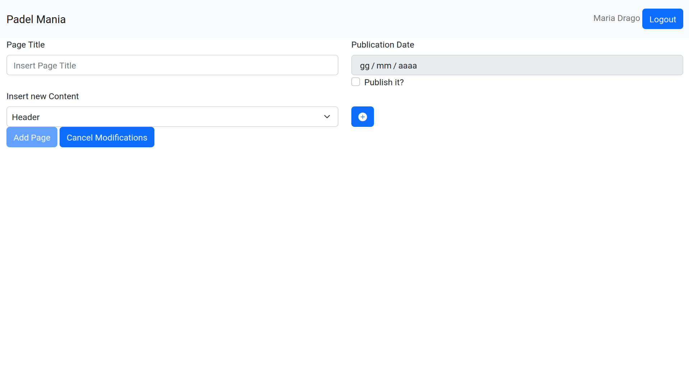
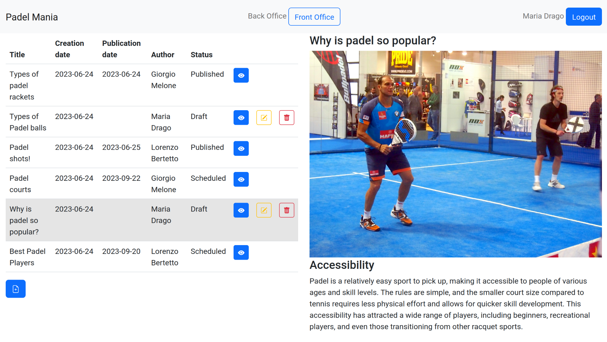

[](https://classroom.github.com/a/_XpznRuT)
# Exam #1: "CMSmall"

## Student: s309618 Bertetto Lorenzo 

# Server side

## API Server

- POST `/api/sessions`
  - request body content
  ```
  {
    "username": "lorenzo.bertetto@exam.polito.it",
    "password": "ComplexPassword"
  }
  ```
  - response body content
  ```
  {
    "id": 1,
    "username": "lorenzo.bertetto@exam.polito.it",
    "name": "Lorenzo Bertetto",
    "admin": true
  }
  ```
- DELETE `/api/sessions/current`
  - request body content: `none`
  - response body content: `none`

- GET `/api/sessions/current`
  - requires the user to be authenticated
  - request parameters: `none`
  - response body content
  ```
  {
    id: 1,
    username: "lorenzo.bertetto@exam.polito.it",
    name: "Lorenzo Bertetto",
    admin: true
  }
  ```
- GET `/api/pages`
  - requires the user to be authenticated
  - request parameters: `none`
  - response body content
  ```
  [
    {
      "id": 125,
      "title": "Types of padel rackets",
      "author": "Giorgio Melone",
      "creationDate": "2023-06-24",
      "publicationDate": "2023-06-24",
      "contents": [
        {
          "id": 505,
          "type": "header",
          "value": "Types of padel rackets",
          "pageId": 125,
          "position": 0
        },
        {
          "id": 506,
          "type": "image",
          "value": "racket.jpg",
          "pageId": 125,
          "position": 1
        }
      ]
    },
    {
      "id": 133,
      "title": "Padel shots!",
      "author": "Lorenzo Bertetto",
      "creationDate": "2023-06-24",
      "publicationDate": "2023-06-24",
      "contents": [
        {
          "id": 616,
          "type": "header",
          "value": "Types of Padel shots",
          "pageId": 133,
          "position": 0
        },
        {
          "id": 617,
          "type": "image",
          "value": "shot.jpg",
          "pageId": 133,
          "position": 1
        },
        {
          "id": 618,
          "type": "header",
          "value": "Forehand drive",
          "pageId": 133,
          "position": 2
        },
        {
          "id": 619,
          "type": "paragraph",
          "value": "The forehand drive is a fundamental shot in padel, where the player hits the ball with a forward swing using the dominant hand on the same side as the ball. It is typically used to return a relatively easy shot or to maintain control of the rally by hitting the ball with medium power and depth.",
          "pageId": 133,
          "position": 3
        }
      ]
    },
    {
      "id": 132,
      "title": "Types of Padel balls",
      "author": "Maria Drago",
      "creationDate": "2023-06-24",
      "publicationDate": null,
      "contents": [
        {
          "id": 605,
          "type": "header",
          "value": "Types of Padel balls",
          "pageId": 132,
          "position": 0
        },
        {
          "id": 606,
          "type": "paragraph",
          "value": "Padel balls are an essential component of the sport, and different types of balls are used based on factors such as playing surface, playing level, and temperature. Here are the main types of padel balls:",
          "pageId": 132,
          "position": 1
        }
      ]
    }
  ]
  ```
- GET `/api/published-pages`
  - request parameters: `none`
  - response body content
  ```
  [
    {
      "id": 125,
      "title": "Types of padel rackets",
      "author": "Giorgio Melone",
      "creationDate": "2023-06-24",
      "publicationDate": "2023-06-24",
      "contents": [
        {
          "id": 505,
          "type": "header",
          "value": "Types of padel rackets",
          "pageId": 125,
          "position": 0
        },
        {
          "id": 506,
          "type": "image",
          "value": "racket.jpg",
          "pageId": 125,
          "position": 1
        }
      ]
    },
    {
      "id": 133,
      "title": "Padel shots!",
      "author": "Lorenzo Bertetto",
      "creationDate": "2023-06-24",
      "publicationDate": "2023-06-24",
      "contents": [
        {
          "id": 616,
          "type": "header",
          "value": "Types of Padel shots",
          "pageId": 133,
          "position": 0
        },
        {
          "id": 617,
          "type": "image",
          "value": "shot.jpg",
          "pageId": 133,
          "position": 1
        },
        {
          "id": 618,
          "type": "header",
          "value": "Forehand drive",
          "pageId": 133,
          "position": 2
        },
        {
          "id": 619,
          "type": "paragraph",
          "value": "The forehand drive is a fundamental shot in padel, where the player hits the ball with a forward swing using the dominant hand on the same side as the ball. It is typically used to return a relatively easy shot or to maintain control of the rally by hitting the ball with medium power and depth.",
          "pageId": 133,
          "position": 3
        }
      ]
    }
  ]
  ```
- GET `/api/title`
  - request parameters: `none`
  - response body content

  ```
  {
    "value": "Padel Bueno"
  }
  ```
- POST `/api/pages`
  - requires the user to be authenticated
  - request body content
  ```
  {
    "title": "New Title",
    "publicationDate": "2023-06-26",
    "contents": [
      {
        "type": "header",
        "value": "New Header"
      },
      {
        "type": "image",
        "value": "racket.jpg"
      },
      {
        "type": "paragraph",
        "value": "Lorem ipsum dolor sit amet, consectetur adipiscing elit, sed do eiusmod tempor incididunt ut labore et dolore magna aliqua. Ut enim ad minim veniam, quis nostrud exercitation ullamco laboris nisi ut aliquip ex ea commodo consequat. Duis aute irure dolor in reprehenderit in voluptate velit esse cillum dolore eu fugiat nulla pariatur. Excepteur sint occaecat cupidatat non proident, sunt in culpa qui officia deserunt mollit anim id est laborum."
      }
    ]
  }
  ```
  - response body content
  ```
  {
    "id": 137,
    "title": "New Title",
    "author": 1,
    "creationDate": "2023-06-25",
    "publicationDate": "2023-06-26",
    "contents": [
      {
        "type": "header",
        "value": "New Header",
        "pageId": 137,
        "position": 0
      },
      {
        "type": "image",
        "value": "racket.jpg",
        "pageId": 137,
        "position": 1
      },
      {
        "type": "paragraph",
        "value": "Lorem ipsum dolor sit amet, consectetur adipiscing elit, sed do eiusmod tempor incididunt ut labore et dolore magna aliqua. Ut enim ad minim veniam, quis nostrud exercitation ullamco laboris nisi ut aliquip ex ea commodo consequat. Duis aute irure dolor in reprehenderit in voluptate velit esse cillum dolore eu fugiat nulla pariatur. Excepteur sint occaecat cupidatat non proident, sunt in culpa qui officia deserunt mollit anim id est laborum.",
        "pageId": 137,
        "position": 2
      }
    ]
  }
  ```
- PUT `/api/pages/:pageId`
  - requires the user to be authenticated: if the user is an admin, he can also insert the field `author` in the body content to modify the author of the page
  - request parameters: 
    - `pageId`: id of the page to be modified (integer value)
  - request body content
  ```
  {
    "title": "Title",
    "author": "Maria Drago",
    "publicationDate": null,
    "contents": [
      {
        "type": "header",
        "value": "Header"
      },
      {
        "type": "image",
        "value": "racket.jpg"
      },
      {
        "type": "paragraph",
        "value": "Edited paragraph."
      }
    ]
  }
  ```
  - response body content
  ```
  {
    "id": 137,
    "title": "Title",
    "author": 3,
    "creationDate": "2023-06-25",
    "publicationDate": null,
    "contents": [
      {
        "type": "header",
        "value": "Header",
        "pageId": 137,
        "position": 0
      },
      {
        "type": "image",
        "value": "racket.jpg",
        "pageId": 137,
        "position": 1
      },
      {
        "type": "paragraph",
        "value": "Edited paragraph.",
        "pageId": 137,
        "position": 2
      }
    ]
  }
  ```
- DELETE `/api/pages/:pageId`
  - requires the user to be authenticated
  - request parameters: 
    - `pageId`: id of the page to be modified (integer value)
  - request body content: `none`
  - response body content: `none`
- PUT `/api/title`
  - requires the user to be authenticated, and to be admin
  - request body content
  ```
  {
    "value": "Padel Mania"
  }
  ```
  - response body content
  ```
  {
    "value": "Padel Mania"
  }
  ```
- GET `/api/users`
  - requires the user to be authenticated, and to be admin
  - request body content: `none`
  - response body content
  ```
  [
    {
      "name": "Lorenzo Bertetto"
    },
    {
      "name": "Giorgio Melone"
    },
    {
      "name": "Maria Drago"
    },
    {
      "name": "Rick Sanchez"
    }
  ]
  ```
## Database Tables

- Table `users` - contains id (integer), email (text), name (text), hash (text), salt (text), admin (boolean)
- Table `pages` - contains id (integer), title (text), author (integer, refers to user id), creationDate (date), publicationDate (date)
- Table `contents` - contains id (integer), type (text, can be one of ['header','paragraph','image']), value (text), pageId (integer, refers to page id), position (integer)
- Table `siteTitle` - contains id (integer), value (text). This table has only one record since the title of the website can be only one.

# Client side


## React Client Application Routes

- Route `/`:
  - Content: Front Office, with published pages (without any page selected)
  - Purpose: show the published pages list to all users (anonymous or not)
- Route `/front`:
  - Content: Front Office, with published pages (without any page selected)
  - Purpose: show the published pages list to all users (anonymous or not)
- Route `/front/:pageShowed`:
  - Content: Front Office, with published pages and `pageShowed`'s contents
  - Purpose: 
    - show the published pages list to all users (anonymous or not)
    - show the `pageShowed`'s contents
  - Param `pageShowed`: id of the page
- Route `/back`:
  - Content: Back Office, with all pages (without any page selected)
  - Purpose: show the full pages list to authenticated users
- Route `/back/:pageShowed`:
  - Content: Back Office, with all pages and `pageShowed`'s contents
  - Purpose: 
    - show the full pages list to authenticated users
    - show the `pageShowed`'s contents
  - Param `pageShowed`: id of the page
- Route `/login`:
  - Content: login form
  - Purpose: enable the user to login to the page
- Route `/edit/:id`:
  - Content: form used for page modifications
  - Purpose: enable the users to edit pages
  - Param `id`: id of the page to be edited
- Route `/add`:
  - Content: form used for adding a new page
  - Purpose: enable the users to add new pages

## Main React Components

- `Layout` (in `Layout.jsx`): header of the entire application. Used to see and modify the site title, to go to the Front/Back Office, to login/logout, to see the user's info
- `Office` (in `Office.jsx`): displays the list of pages, depending if we are in the front or back office. It shows some buttons to add/delete/modify the pages depending on the user.
- `Page` (in `Page.jsx`): displays a page's contents
- `Login` (in `Login.jsx`): shows the login form. Enables the users to insert their credentials to perform a login
- `Modification` (in `Modification.jsx`): shows the form to edit/add a page. Here you can also modify the contents of the page and the order of the contents

# Usage info

## Example Screenshot





## Users Credentials

- lorenzo.bertetto@exam.polito.it, ComplexPassword
- giorgio.melone@exam.gov.it, LoremIpsum
- maria.drago@exam.gov.it, DolorSit
- rick.sanchez@greenportalproductions.it, AmetConsectetur
